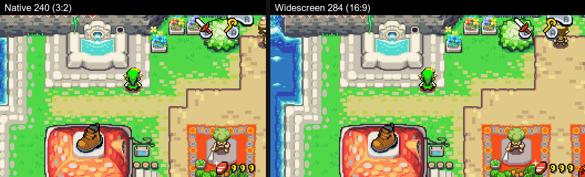
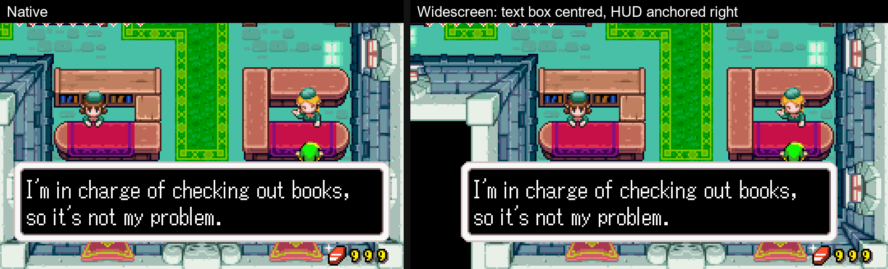
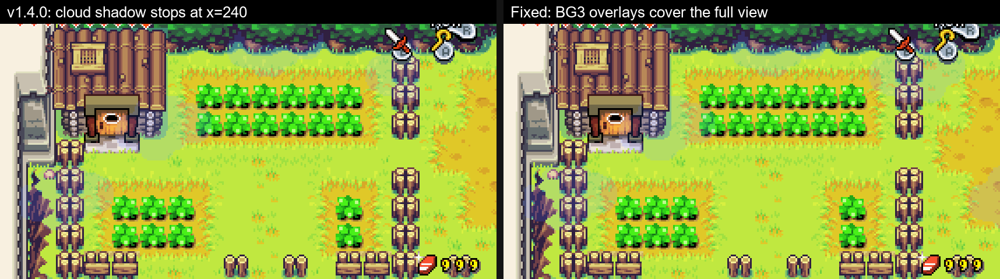
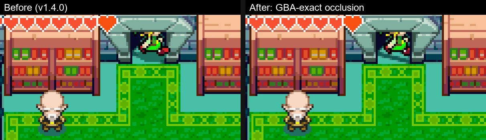
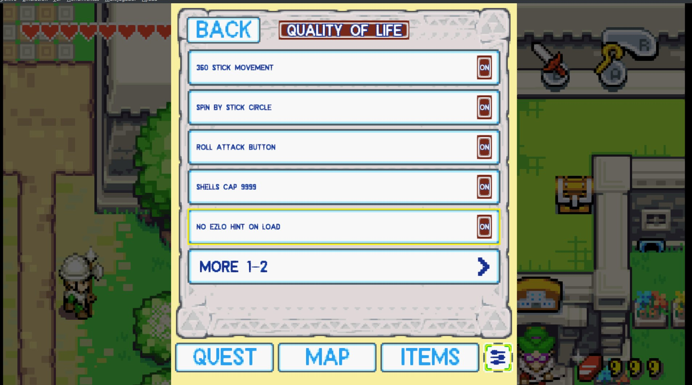
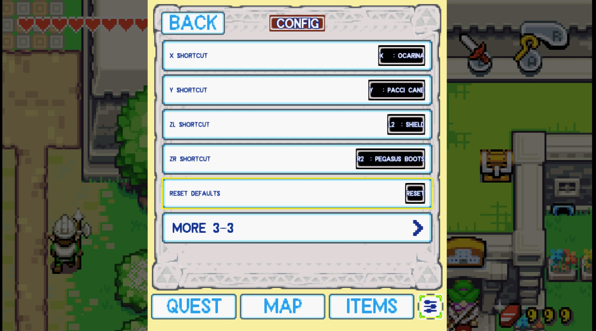
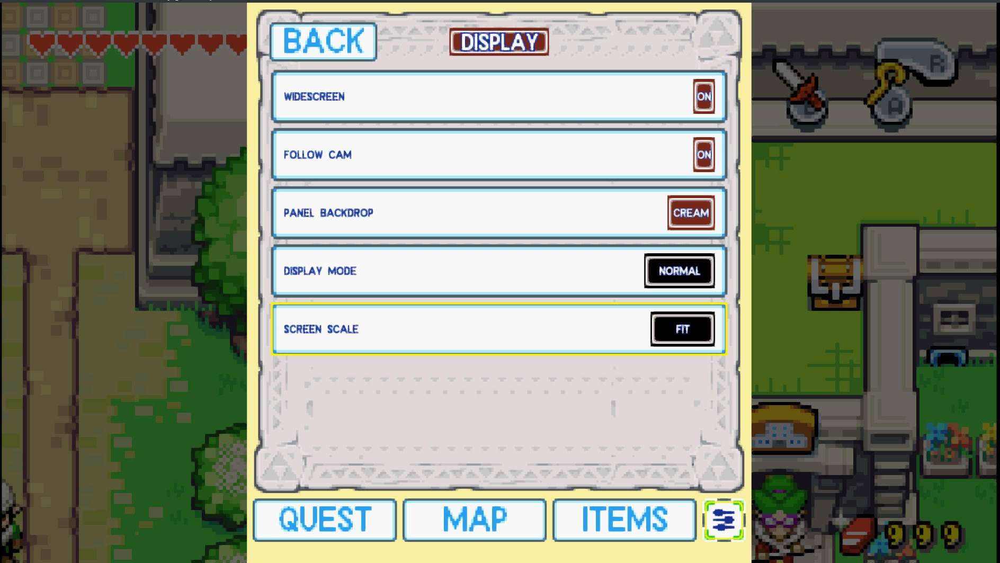

  

# The Legend of Zelda: The Minish Cap — Alek's Ultimate NX Edition

**v1.3.9** · Native Nintendo Switch homebrew port · [Español → README_ES.md](README_ES.md)

## What is this?

A Nintendo Switch-focused edition of the native *The Minish Cap* port, built on
the open-source decompilation and the native-port projects listed in
[CREDITS.md](CREDITS.md). It runs the game natively on the Switch — this is not
an emulator — and adds a second-screen companion display, touch and controller
interaction, RetroAchievements, a full Brazilian Portuguese translation of the
game, a localized port UI, an in-app updater and a set of Switch-specific
quality-of-life features.

I made this because I wanted to play *The Minish Cap* this specific way on my
own Switch: with a dual-screen layout in the spirit of the DS Zelda games, a
vertical Flip-Grip-style mode, and achievements. It is shared publicly in case
other people want to play it, study it, fork it, or use it as a starting point
for their own work.

This project did **not** create the Minish Cap decompilation, the native PC
port, or the original dual-screen concept. It stands on the projects credited
below — please see [CREDITS.md](CREDITS.md) for the full lineage.

## Features

- **Native Switch build** — no emulator, runs as homebrew (NRO).
- **Widescreen (16:9)** in NORMAL mode: the camera shows more of the room on
  both sides, text boxes stay centred and the HUD anchors to the edges. Rooms
  narrower than the view are pillarboxed, never stretched. Holds 60 FPS at the
  stock CPU clock thanks to the tile-based renderer.
- **Quality of life** (SETTINGS → GAMEPLAY → QUALITY OF LIFE, all toggles):
  360° stick movement, spin attack by rolling the stick and pressing B, a
  one-button roll attack, Pegasus dash that turns with the stick (1.4.1),
  shells cap 9999, no Ezlo hint after loading a save, fairer figurine odds,
  optional Hero Mode and Ezlo-tutorial skip.
- **Screen filters** — scanlines (hard / soft) and a GBA LCD grid, drawn on
  the GPU at no FPS cost (SETTINGS → DISPLAY).
- **Three display modes**
  - **NORMAL** — classic single-screen presentation (Fit or exact 2×/3×/4×).
  - **DUAL** — gameplay plus a second-screen companion panel, side by side.
  - **FLIP 270** — a vertical composition designed for physically rotating the
    Switch (works well with a Flip-Grip-style holder; not affiliated with any
    accessory maker).
- **Second-screen panel** with four tabs:
  - **QUEST** — current main quest, objective, hint and location (Story Guide).
  - **MAP** — overworld and dungeon maps with Link's live position marker,
    windcrest pins, floor auto-return and optional follow camera.
  - **ITEMS** — equipment view with A/B rings and X/Y/ZL/ZR shortcut rings
    (soft slots: equip a third and fourth item without opening the pause
    menu). Drag an item onto any ring to assign it, drag ring to ring to
    swap, drag a shortcut ring away (or hold it) to empty it (1.4.4).
  - **SETTINGS** — every port setting, plus the updater and build info.
- **Works with touch or controller.** In NORMAL mode the panel opens as an
  overlay with **Minus** and stays up on any tab: D-pad moves, **A / B**
  activate (on ITEMS: equip to the A or B slot), **L / R** cycle the tabs,
  **A** on the map opens the region Link is standing in.
- **Full Brazilian Portuguese translation of the game** (every dialogue, sign
  and item description — 2910 messages), running on the USA ROM. Select it
  under SETTINGS → GENERAL → LANGUAGE.
- **RetroAchievements** — login, game recognition, Rich Presence, unlock
  notifications with real badge artwork, and **offline play**: unlocks earned
  without a connection are queued with their original time and sent on
  reconnect (softcore only, per RetroAchievements' policy). Requires a free
  [retroachievements.org](https://retroachievements.org) account.
- **Saves interchangeable with emulators** — `tmc.sav` uses the same byte
  order as mGBA / VBA-M / cartridge dumps (since v1.3.9). Copy it to
  `<rom>.sav` or back with no conversion.
- **Port-managed Autosave** and **Load Autosave** — separate from, and never
  overwriting, the game's own save system.
- **In-app updater** — check for, download and install new versions from the
  second screen, without a PC. The download is verified against a size and
  SHA-256 pinned in the manifest, a verified backup of your current build is
  made first, and any failure restores it. See [Updating](#updating).
- **Talk to Ezlo** shortcut (Left Stick click by default, rebindable), a
  **Return to Title** entry, and a contextual **Action Hint** for the R button
  (OFF / CONTEXTUAL / ON).
- **Localized port UI** in English, Español, Français, Deutsch, Italiano and
  Português (Brasil). (The original game's own dialogue localization is
  Nintendo's; this project localizes the port's added interface and ships the
  PT-BR game translation as its own work.)
- **Fast Boot** — startup around 13–14 s on tested hardware; actual time
  depends on the SD card.
- **Engine hardening** — the 1.3.x line audited every entity type for 64-bit
  layout drift (~130 structures, each with a compile-time check), ported the
  engine fixes from the upstream PC port up to v0.9.3, and closed the crash
  and softlock reports from the community. Details in
  [CHANGELOG.md](CHANGELOG.md).

**Widescreen** (true 16:9 with more world on screen, no stretching) is in
development for **v1.4** and is not part of v1.3.9.

## Screenshots

| DUAL | NORMAL | FLIP 270 |
|---|---|---|
|  |  |  |

Widescreen (v1.4.0), native 240 columns next to the 284-column 16:9 view:

Settings (v1.4.0): the Quality-of-life page, shortcut slots, and widescreen on/off:

| QUALITY OF LIFE | CONTROLS | WIDESCREEN |
|---|---|---|
|  |  |  |

Real achievement unlock, on real hardware, in Deepwood Shrine:

### Port UI localization

<table>
  <tr>
    <td align="center"><b>English</b></td>
    <td align="center"><b>Español</b></td>
    <td align="center"><b>Français</b></td>
  </tr>
  <tr>
    <td></td>
    <td></td>
    <td></td>
  </tr>
  <tr>
    <td align="center"><b>Deutsch</b></td>
    <td align="center"><b>Italiano</b></td>
    <td></td>
  </tr>
  <tr>
    <td></td>
    <td></td>
    <td></td>
  </tr>
</table>

More in [docs/SCREENSHOTS.md](docs/SCREENSHOTS.md).

### Localization and ROM base

This edition is built and tested with the **USA ROM** (header `BZME`). The
port's own UI is available in six languages, and the Brazilian Portuguese
option translates the whole game on top of that same USA ROM — no EU ROM and
no patched ROM are needed. Using the port UI in another language does not
convert the ROM: for the other languages, the in-game dialogue is whatever
your own ROM provides.

## Installation

Short version — full guide in [docs/INSTALLATION.md](docs/INSTALLATION.md):

1. Copy the NRO to `/switch/tmc/` on your SD card, keeping its name
   (`tmc_aleks_ultimate_nx.nro`) — that is the file the in-app updater
   replaces.
2. Copy your **own, legally obtained** *The Minish Cap* **USA** ROM (`.gba`)
   into the same folder. The filename does not matter — the port identifies
   the ROM by its header. `baserom.gba` is the conventional name.
3. Launch from the Homebrew Menu. Application mode (launching over a full
   title) is recommended for best performance.

**No ROM is included with this project, no ROM download link is provided, and
no copyrighted game content is distributed.** You must dump your own cartridge
or otherwise obtain the game legally.

### Saves

- `/switch/tmc/tmc.sav` is the game's own save (the three in-game files).
  From **v1.3.9** it is written in the standard emulator byte order, so you
  can copy it to mGBA / VBA-M as `<rom>.sav` and back with no conversion. Saves
  written by older versions are detected and loaded automatically.
- **A save written by v1.3.9 or later will not load on v1.3.8 or older.** If
  you ever downgrade, restore `tmc.sav.bak` (a copy taken at each start-up).
- Autosaves (`autosave_*.bin`) are the port's own and are independent of
  `tmc.sav`.

### After updating: the `assets/` folder

The first launch extracts the game's assets from your ROM into
`/switch/tmc/assets/`. **Updating the NRO does not refresh that folder.** If
after an update you see wrong graphics or text, delete `assets/` and launch
again — the game regenerates it in about a minute. Saves are not affected.

## Updating

On the second screen go to **SETTINGS → SYSTEM**, and use the update row:

1. **CHECK FOR UPDATES** — contacts the project's update manifest.
2. **DOWNLOAD UPDATE** — fetches the new build and verifies it.
3. **INSTALL UPDATE** — backs up your current build, then installs.
4. **Close the game and open it again** to run the new version.

The console needs an internet connection for steps 1 and 2 only.

### What it does and does not touch

The updater replaces the game program (`tmc_aleks_ultimate_nx.nro`) and nothing
else. Your ROM, saves, autosave data, extracted assets and `config.json` are
never read or written by it.

Before the installed game is replaced, a verified copy of it is written to
`/switch/tmc/tmc_aleks_ultimate_nx.bak`. If the install fails at any point,
that backup is restored automatically. If you ever want to go back manually,
copy the `.bak` over the `.nro`.

### Why it is built the way it is

Update metadata comes from a project-controlled manifest with a closed schema:
an unknown key, a duplicate key, a non-HTTPS URL, the wrong channel or a
malformed field rejects the whole manifest rather than being ignored. The
expected size and SHA-256 of the new build are pinned in that manifest before
any of it is downloaded, and the downloaded file is verified against them
before it is allowed anywhere near your installed game. Downloads are
HTTPS-only, redirects are HTTPS-only, and certificates are verified.

If you would rather not use it, you can keep updating by hand: download the
NRO from the [releases page](../../releases) and copy it over
`/switch/tmc/tmc_aleks_ultimate_nx.nro` yourself.

## ROM compatibility

Release builds target the **USA** version (header `BZME`). The known-good USA
reference dump has SHA-1 `b4bd50e4131b027c334547b4524e2dbbd4227130` — the port
does not verify this hash at runtime (it identifies the game by header), but
that is the dump every release is built and tested against. EU (`BZMP`) is
recognized by the loader but is not a supported base; use a USA ROM.

## Performance

NORMAL (including widescreen) runs at 60 FPS at the stock CPU clock since
v1.4.0, when the software PPU moved from per-pixel to per-tile rendering.
DUAL and FLIP are more demanding than NORMAL and also gained from that
change; on tested hardware a 1224 MHz CPU clock still gives them the most
consistent 60 FPS. This is optional and does not guarantee a locked 60 FPS in
every scene. Details in [docs/PERFORMANCE.md](docs/PERFORMANCE.md).

## Configuration

Every setting in SETTINGS (GAMEPLAY, CONTROLS, DISPLAY, ACHIEVEMENTS, SYSTEM)
is documented in [docs/CONFIGURATION.md](docs/CONFIGURATION.md).

## Development transparency

This project was developed with significant AI assistance — including Claude /
Claude Code, ChatGPT and OpenAI Codex — for code investigation, debugging,
implementation, code review, documentation and release preparation. Project
direction, feature decisions, real-hardware testing, visual validation and all
release decisions were made manually by the maintainer. This describes how
*this edition* was built; the upstream projects it builds on have their own
development histories, and no assumptions are made here about the tools or
workflows their maintainers used. A full description is in
[docs/DEVELOPMENT_TRANSPARENCY.md](docs/DEVELOPMENT_TRANSPARENCY.md).

## Maintenance expectations

This is a personal project. I intend to keep improving it until it reaches a
state I consider fully playable and stable for how I want to play it. After
that, updates may become infrequent or stop. I do not promise long-term
support, a roadmap, or timely responses to issues. If you want to take it
further, forks are welcome under the applicable upstream licenses — see
[CONTRIBUTING.md](CONTRIBUTING.md).

## Reporting a bug

Released builds keep diagnostics on disk, so a report can carry evidence.
Please attach whatever of these exists, along with the version shown under
**SETTINGS → SYSTEM → BUILD INFO**:

| File | What it is |
|---|---|
| `/switch/tmc/tmc.log` | Boot log: build identity, asset loading, ROM resolution, errors. Starts with a `[build]` line naming the exact version — always include it. |
| `/switch/tmc/startup.log` | Per-phase boot timings. Useful for slow-start or hang-at-boot reports. |
| `/switch/tmc/crashlogs/` | Written only if the game crashed — **this is the file that matters for a crash**; `tmc.log` alone usually is not enough. |
| `/switch/tmc/ra.log` | RetroAchievements activity, for achievement reports. |
| `/atmosphere/crash_reports/` | The system's own crash report, same moment. |

A screenshot or a short video helps a lot for anything visual, and your
`tmc.sav` lets the problem be reproduced exactly. Please also say whether you
deleted `assets/` after updating (see above) — a stale asset folder explains
many "wrong graphics" reports.

## Known issues

See [docs/KNOWN_ISSUES.md](docs/KNOWN_ISSUES.md). In heavier scenes DUAL and
FLIP can dip below 60 FPS.

## Credits and lineage

This edition exists because of the projects below. The short version:

- [zeldaret/tmc](https://github.com/zeldaret/tmc) — the Minish Cap
  decompilation everything is built on.
- [Project Picori (999sian/tmc)](https://github.com/999sian/tmc) — the native
  PC port foundation. Its engine fixes are ported into this edition regularly
  (up to v0.9.3 as of v1.3.9), and its widescreen work is the base of the
  upcoming v1.4.
- [HayatoG/tmc](https://github.com/hayatog/tmc) — the original Nintendo Switch
  port and the direct base this tree is forked from.
- [samyost1/tmc-android](https://github.com/samyost1/tmc-android) — the
  dual-screen second-screen concept and implementation this work extends.
- [EstebanPdN/zelda-tmc-3ds](https://github.com/EstebanPdN/zelda-tmc-3ds) —
  the 3DS dual-screen adaptation; several of its engine fixes are ported here.

Thanks to everyone testing on real hardware and reporting on GBAtemp and
GitHub — most of the 1.3.x fixes started as one of your reports.

Full roles, third-party libraries and license details:
[CREDITS.md](CREDITS.md) · [THIRD_PARTY_NOTICES.md](THIRD_PARTY_NOTICES.md).

## Legal

This is an unofficial fan project, not affiliated with, endorsed by, or
supported by Nintendo. *The Legend of Zelda* and *The Minish Cap* are
trademarks of Nintendo. No original game assets, ROMs, or copyrighted
Nintendo content are distributed with this project.
