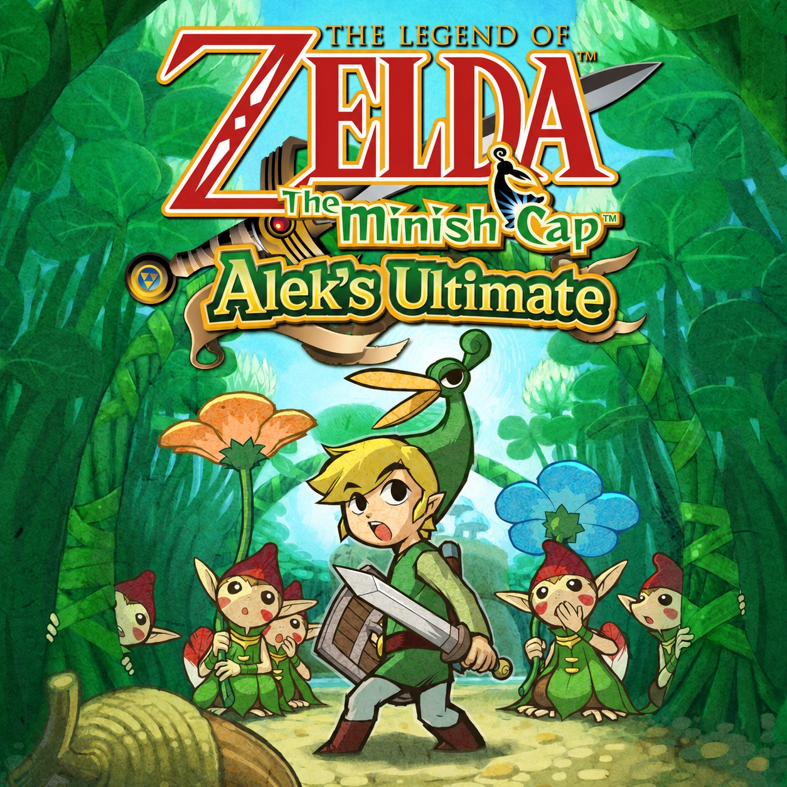
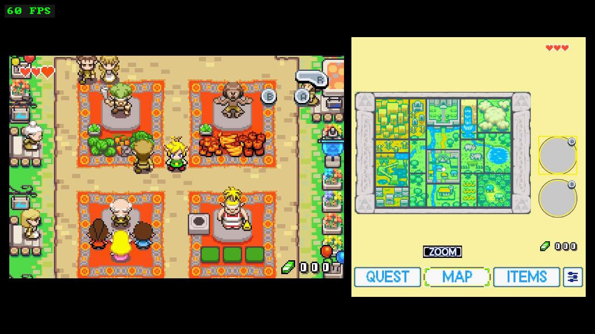
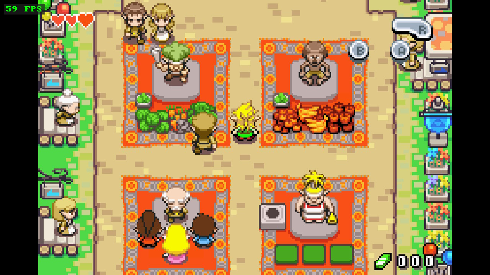
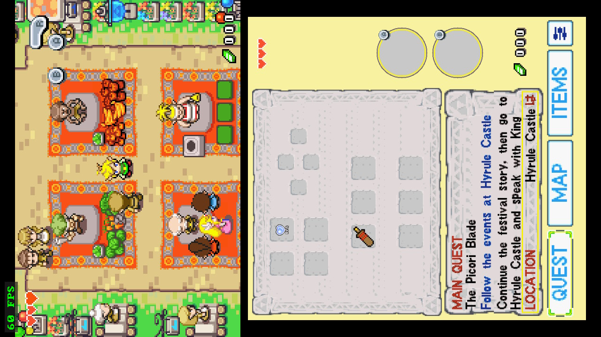
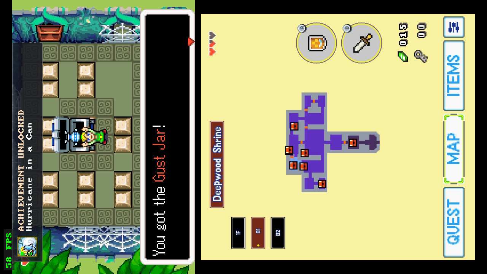
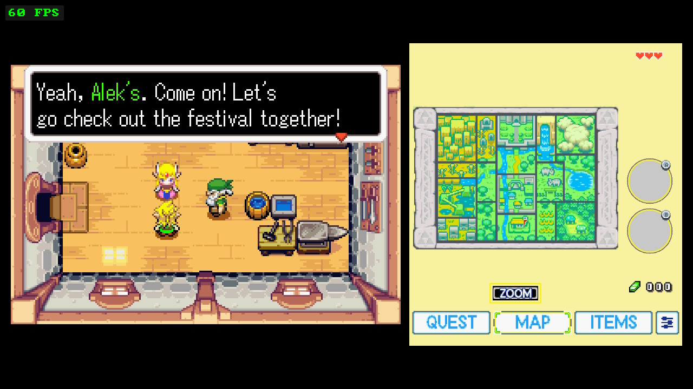
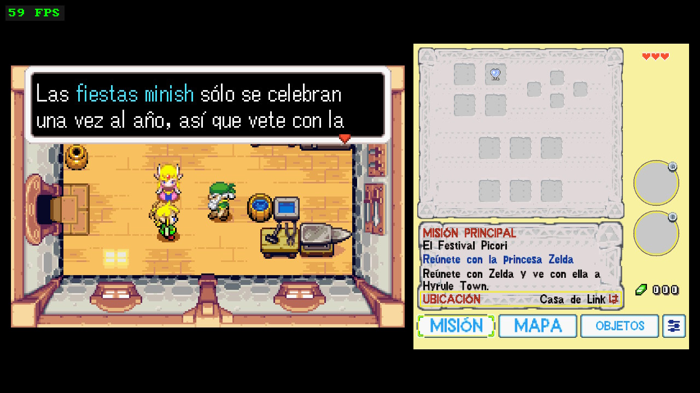
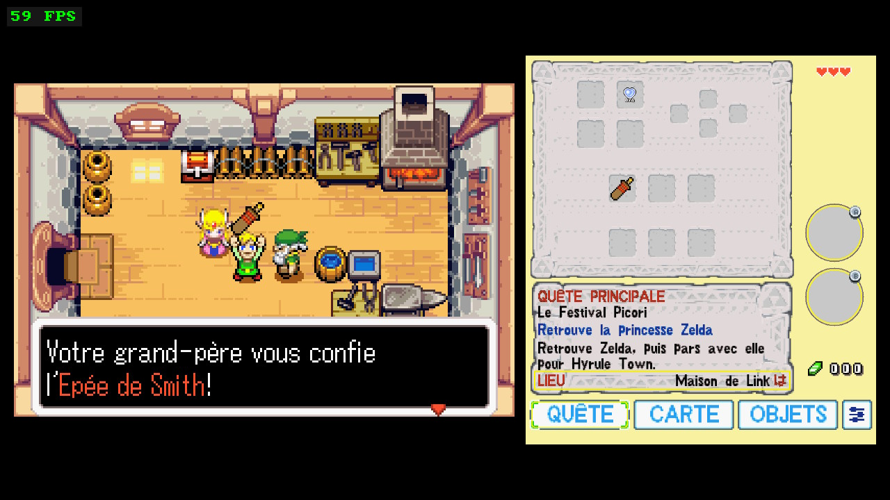
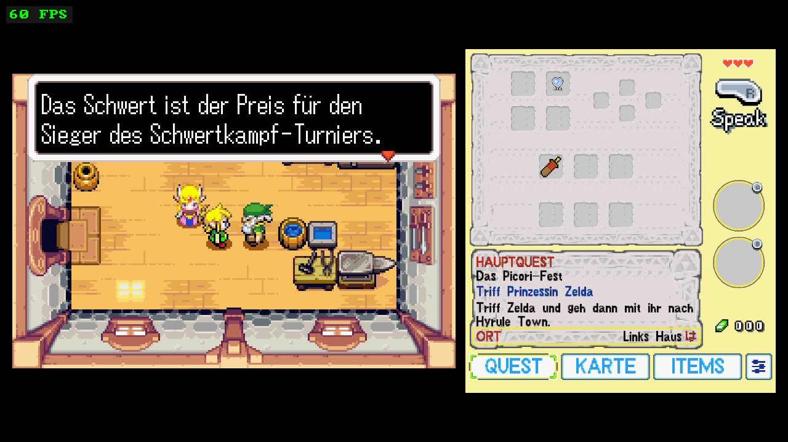
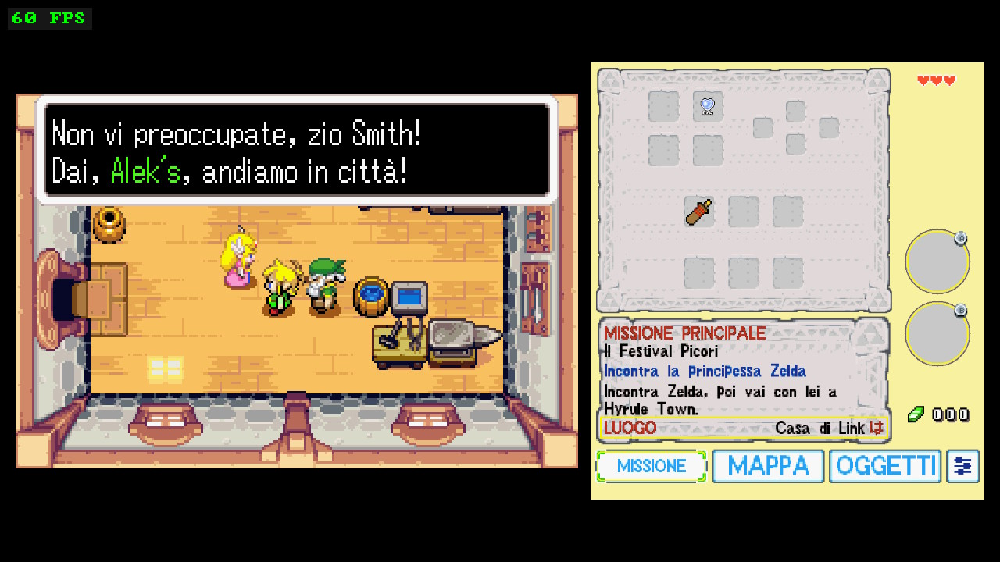

  

# The Legend of Zelda: The Minish Cap — Alek's Ultimate NX Edition

**v1.0.1** · Native Nintendo Switch homebrew port · [Español → README_ES.md](README_ES.md)

## What is this?

A personal Nintendo Switch-focused edition of the native *The Minish Cap* port,
built on the open-source decompilation and the native-port projects listed in
[CREDITS.md](CREDITS.md). It runs the game natively on the Switch — this is not
an emulator — and adds a second-screen companion display, touch interaction,
RetroAchievements, a localized port UI, and a set of Switch-specific
quality-of-life features.

I made this primarily because I wanted to play *The Minish Cap* this specific
way on my own Switch: with a dual-screen layout in the spirit of the DS Zelda
games, a vertical Flip-Grip-style mode, and achievements. It is shared publicly
in case other people want to play it, study it, fork it, or use it as a
starting point for their own work.

This project did **not** create the Minish Cap decompilation, the native PC
port, or the original dual-screen concept. It stands on the projects credited
below — please see [CREDITS.md](CREDITS.md) for the full lineage.

## Features

- **Native Switch build** — no emulator, runs as homebrew (NRO).
- **Three display modes**
  - **NORMAL** — classic single-screen presentation.
  - **DUAL** — gameplay plus a second-screen companion panel, side by side.
  - **FLIP 270** — a vertical composition designed for physically rotating the
    Switch (works well with a Flip-Grip-style holder; not affiliated with any
    accessory maker).
- **Second-screen panel** with four tabs:
  - **QUEST** — current main quest, objective, hint and location (Story Guide).
  - **MAP** — overworld and dungeon maps with Link's live position marker and
    optional follow camera.
  - **ITEMS** — equipment view with A/B rings and X/Y/ZL/ZR shortcut slots.
  - **CONFIG** — all port settings.
- **Touchscreen** interaction on the panel (tabs, settings, item assignment).
- **RetroAchievements** — login, game recognition, Rich Presence, real unlock
  notifications with real badge artwork, and logout. Requires a free
  [retroachievements.org](https://retroachievements.org) account.
- **Port-managed Autosave** and **Load Autosave** — separate from, and never
  overwriting, the game's own save system.
- **In-app updater** — check for, download and install new versions from the
  second screen (SYSTEM), without a PC. The download is verified against a
  size and SHA-256 pinned in advance, and a verified backup of your current
  build is created before anything is replaced; if any step fails, the backup
  is restored and your installed game is left untouched. See
  [Updating](#updating).
- **Return to Title** from the menu.
- **Localized port UI** in English, Español, Français, Deutsch and Italiano.
  (The original game's own dialogue localization is Nintendo's; this project
  localizes only the port's added interface.)
- **Action Hint** — the contextual R-button hint on the panel can be set to
  OFF / CONTEXTUAL / ON.
- **Substantially reduced startup time** (Fast Boot). Startup was observed at
  roughly 13–14 seconds on the maintainer's tested hardware; actual startup
  time may vary depending on SD-card and system conditions.

True widescreen is **not** part of v1.0.0.

## Screenshots

| DUAL | NORMAL | FLIP 270 |
|---|---|---|
|  |  |  |

Real achievement unlock, on real hardware, in Deepwood Shrine:

### Port UI localization

<table>
  <tr>
    <td align="center"><b>English</b></td>
    <td align="center"><b>Español</b></td>
    <td align="center"><b>Français</b></td>
  </tr>
  <tr>
    <td></td>
    <td></td>
    <td></td>
  </tr>
  <tr>
    <td align="center"><b>Deutsch</b></td>
    <td align="center"><b>Italiano</b></td>
    <td></td>
  </tr>
  <tr>
    <td></td>
    <td></td>
    <td></td>
  </tr>
</table>

The English capture happens to show the MAP tab, the other four show QUEST —
all five are the port's own UI in that language. More in
[docs/SCREENSHOTS.md](docs/SCREENSHOTS.md).

### Localization and ROM base

Alek's Ultimate NX Edition is primarily tested with the **USA ROM** as its
recommended base. The port adds its own multilingual UI layer for port-specific
menus and features in English, Spanish, French, German and Italian.

The original game's dialogue/localization content remains part of the
underlying game data; this project does not claim authorship of Nintendo's
official translations. Using the port UI in Spanish does not convert a USA ROM
into another regional release — the in-game dialogue language is whatever your
own ROM provides.

## Installation

Short version — full guide in [docs/INSTALLATION.md](docs/INSTALLATION.md):

1. Copy the NRO to `/switch/tmc/` on your SD card.
2. Copy your **own, legally obtained** *The Minish Cap* **USA** ROM (`.gba`)
   into the same folder. The filename does not matter — the port identifies
   the ROM by its header. `baserom.gba` is the conventional name.
3. Launch from the Homebrew Menu. Application mode (launching over a full
   title) is recommended for best performance.

**No ROM is included with this project, no ROM download link is provided, and
no copyrighted game content is distributed.** You must dump your own cartridge
or otherwise obtain the game legally.

## Updating

From v1.0.0 on, the game can update itself. On the second screen go to
**CONFIG → SYSTEM**, and use the update row:

1. **CHECK FOR UPDATES** — contacts the project's update manifest.
2. **DOWNLOAD UPDATE** — fetches the new build and verifies it.
3. **INSTALL UPDATE** — backs up your current build, then installs.
4. **Close the game and open it again** to run the new version.

The console needs an internet connection for steps 1 and 2 only.

### What it does and does not touch

The updater replaces the game program (`tmc_aleks_ultimate_nx.nro`) and nothing
else. Your ROM, saves, autosave data, extracted assets and `config.json` are
never read or written by it.

Before the installed game is replaced, a verified copy of it is written to
`/switch/tmc/tmc_aleks_ultimate_nx.bak`. If the install fails at any point,
that backup is restored automatically. If you ever want to go back manually,
copy the `.bak` over the `.nro`.

### Why it is built the way it is

Update metadata comes from a project-controlled manifest with a closed schema:
an unknown key, a duplicate key, a non-HTTPS URL, the wrong channel or a
malformed field rejects the whole manifest rather than being ignored. The
expected size and SHA-256 of the new build are pinned in that manifest before
any of it is downloaded, and the downloaded file is verified against them
before it is allowed anywhere near your installed game. Downloads are
HTTPS-only, redirects are HTTPS-only, and certificates are verified.

If you would rather not use it, you can keep updating by hand: download the
NRO from the [releases page](../../releases) and copy it over
`/switch/tmc/tmc_aleks_ultimate_nx.nro` yourself.

## ROM compatibility

The v1.0.0 release build targets the **USA** version (header `BZME`). The
known-good USA reference dump has SHA-1
`b4bd50e4131b027c334547b4524e2dbbd4227130` — the port does not verify this
hash at runtime (it identifies the game by header), but that is the dump this
release was built and tested against. EU (`BZMP`) headers are recognized by
the loader, but v1.0.0 is built and tested as the USA edition; use a USA ROM.

## Performance

NORMAL runs at 60 FPS with the most headroom. DUAL and FLIP are more demanding
than NORMAL. On tested hardware, a 1224 MHz CPU clock is recommended for
performance closer to a consistent 60 FPS in DUAL and FLIP. This is optional
and does not guarantee a locked 60 FPS in every scene. The port never changes
the clock itself; automatic clock-management integration is still being
evaluated. Details in [docs/PERFORMANCE.md](docs/PERFORMANCE.md).

## Configuration

Every setting in CONFIG (GAMEPLAY, CONTROLS, DISPLAY, ACHIEVEMENTS, SYSTEM) is
documented in [docs/CONFIGURATION.md](docs/CONFIGURATION.md).

## Development transparency

This project was developed with significant AI assistance — including Claude /
Claude Code, ChatGPT and OpenAI Codex — for code investigation, debugging,
implementation, code review, documentation and release preparation. Project
direction, feature decisions, real-hardware testing, visual validation and all
release decisions were made manually by the maintainer. This describes how
*this edition* was built; the upstream projects it builds on have their own
development histories, and no assumptions are made here about the tools or
workflows their maintainers used. A full description is in
[docs/DEVELOPMENT_TRANSPARENCY.md](docs/DEVELOPMENT_TRANSPARENCY.md).

## Maintenance expectations

This is a personal project. I intend to keep improving it until it reaches a
state I consider fully playable and stable for how I want to play it. After
that, updates may become infrequent or stop. I do not promise long-term
support, a roadmap, or timely responses to issues. If you want to take it
further, forks are welcome under the applicable upstream licenses — see
[CONTRIBUTING.md](CONTRIBUTING.md).

## Known issues

See [docs/KNOWN_ISSUES.md](docs/KNOWN_ISSUES.md). Two worth flagging here: in
heavier scenes DUAL and FLIP can dip below 60 FPS, and after visiting the
Deepwood Shrine rotating barrel, returning to the title screen may cause
temporary affine/visual artifacts — a clean application restart restores the
title screen normally.

## Credits and lineage

This edition exists because of the projects below. The short version:

- [zeldaret/tmc](https://github.com/zeldaret/tmc) — the Minish Cap
  decompilation everything is built on.
- [Project Picori (999sian/tmc)](https://github.com/999sian/tmc) — the native
  PC port foundation.
- [samyost1/tmc-android](https://github.com/samyost1/tmc-android) — the
  dual-screen second-screen concept and implementation this work extends.
- [EstebanPdN/zelda-tmc-3ds](https://github.com/EstebanPdN/zelda-tmc-3ds) —
  the 3DS dual-screen adaptation used as a reference.
- [HayatoG/tmc](https://github.com/hayatog/tmc) — the direct base this Switch
  tree is forked from.

Full roles, third-party libraries and license details:
[CREDITS.md](CREDITS.md) · [THIRD_PARTY_NOTICES.md](THIRD_PARTY_NOTICES.md).

## Legal

This is an unofficial fan project, not affiliated with, endorsed by, or
supported by Nintendo. *The Legend of Zelda* and *The Minish Cap* are
trademarks of Nintendo. No original game assets, ROMs, or copyrighted
Nintendo content are distributed with this project.
